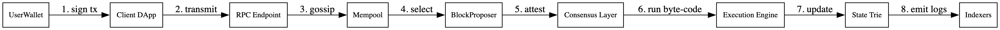
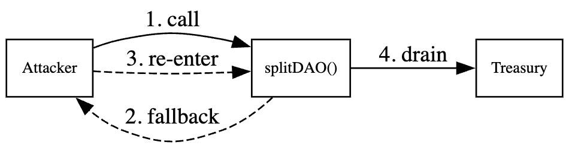
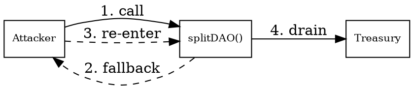
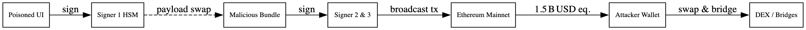
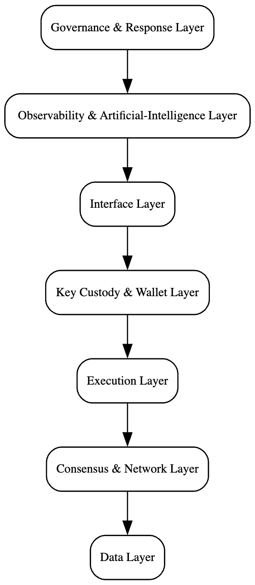
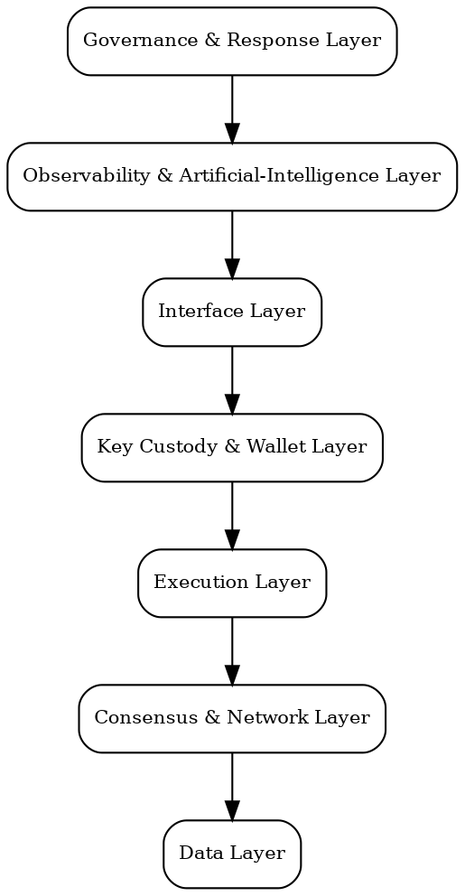

# Web 3.0 Architecture & Security

## Table of Contents
1. Overview & Learning Objectives
2. Lecture Notes (Expanded)
   - 2.1 Web 1.0 vs Web 2.0 vs Web 3.0 Primer
   - 2.2 Core Web 3.0 Architecture Layers
   - 2.3 Web 3.0 Design Principles
   - 2.4 Security Threat Landscape
   - 2.5 Case Studies: **The DAO (2016)** & **Bybit Breach (2025)**
3. Investigation Labs
4. Homework & Discussion Prompts
5. Embedded Diagrams (Graphviz)
6. APA‑formatted References

---

## 1  Overview & Learning Objectives

* Distinguish the technological and governance differences among Web 1.0, Web 2.0 and Web 3.0.
* Identify common smart‑contract, protocol and infrastructure vulnerabilities.
* Reproduce a historic exploit in a safe environment and trace attacker funds on a public test network.
* Propose layered security controls for a decentralised application.

---

## 2  Lecture Notes — Comprehensive Edition


### 2.1 Web 1.0 ⇢ Web 2.0 ⇢ Web 3.0 Primer

#### 2.1.1 Evolutionary Context
* **Web 1.0 (≈ 1990 – 2004)** – Static HyperText Markup Language pages served from a handful of centrally managed servers. No dynamic sessions; limited server‑side code via *Common Gateway Interface (CGI)*.
* **Web 2.0 (≈ 2004 – 2020)** – Asynchronous JavaScript, user‑generated content, application programming interfaces and mega‑platforms (e.g., Facebook, YouTube). Identity delegated to **Open Authorization (OAuth)** providers; data lives in cloud warehouses.
* **Web 3.0 (≈ 2020 –  )** – Programmable blockchains, permissionless smart contracts, token incentives, **self‑sovereign identity** and composable services executed on a **deterministic state machine** (e.g., Ethereum Virtual Machine — EVM).

#### 2.1.2 Comparative Breakdown
| Dimension | Web 1.0 Example | Web 2.0 Example | Web 3.0 Example | Primary Security Shift |
|-----------|-----------------|-----------------|-----------------|------------------------|
| Identity  | HTTP Basic Auth | Google OAuth | Externally‑Owned Account (EOA) + Ethereum Name Service | Secret key becomes single recovery factor |
| Data      | MySQL on Apache | Amazon Relational Database Service (RDS) | InterPlanetary File System (IPFS) / Arweave permanent storage | Content addressing → tamper‑evident archives |
| Compute   | CGI scripts | AWS Lambda function | EVM byte‑code or WebAssembly roll‑up | Fully deterministic ⇒ formal proofs feasible |
| Governance| Webmaster | Corporate board | Decentralised Autonomous Organisation (DAO) with on‑chain voting | Economic incentives can be gamed (governance bribes) |
| Monetisation | Banner ads | Targeted advertising | Token issuance, decentralised finance staking | Compliance & key custody risks |

#### 2.1.3 Illustrative User Path
*Web 1.0:* Carol loads `company.com/about.html` and passively reads.

*Web 2.0:* Carol logs into Instagram and posts an image that Instagram stores and monetises.

*Web 3.0:* Carol signs a transaction with a hardware wallet; the transaction mints her photo as a non‑fungible token (NFT) whose ownership record is immutable on a public ledger.

---

### 2.2 Core Architecture Layers (Deep Dive)
The Web 3.0 software stack can be visualised as a seven‑layer onion. Each layer exposes a minimal, explicit interface to the layer above, enabling **composability** and **trust minimisation**.

| # | Layer | Internals & Protocols | Typical Tooling | Critical Security Controls |
|---|-------|-----------------------|-----------------|----------------------------|
| 1 | **Client / User Interface** | Wallet browser extension, message signer, transaction builder, QR code scanner | React + *Ethers.js*, Svelte, *WalletConnect*, Progressive Web App offline cache | Sub‑resource integrity, content‑security‑policy headers, anti‑phishing address book |
| 2 | **Wallet & Key Management** | Elliptic‑curve cryptography (secp256k1) key‑pairs, BIP‑39 seed mnemonic, BIP‑32 hierarchical deterministic derivation | MetaMask, Ledger Nano, Trezor, Fireblocks Multi‑Party Computation (MPC) | Hardware isolated keys, Shamir secret‑sharing backup, account abstraction limits |
| 3 | **Smart‑Contract / Execution Layer** | Solidity byte‑code, storage trie, *Application Binary Interface (ABI)*, event logs | Hardhat, Foundry, Brownie, OpenZeppelin libraries | Re‑entrancy guard, checks‑effects‑interactions pattern, upgrade beacon proxy safeguards |
| 4 | **Consensus Layer** | Validator set, proposer‑builder separation, finality gadget (e.g., Ethereum Gasper), block gossip network | Geth, Prysm, Lighthouse, Solana Validator | Slashing for equivocation, attestation inclusion checks, time‑sync proofs |
| 5 | **Data Availability & Storage** | Merkle‑DAG chunking, erasure coding, pinning incentives, permanence endowments | IPFS Cluster, Arweave, Celestia namespaced‑merkle‑tree | Proof‑of‑replication, encrypted client‑side shards, pay‑for‑inclusion receipts |
| 6 | **Off‑chain Services** | Oracle scripts, indexer GraphQL subgraphs, miner‑extractable value (MEV) relays, account abstraction bundlers | Chainlink OCR, The Graph, Flashbots, Biconomy | Multi‑source quorum, TLS pinning, relay reputation scores, rate‑limits |
| 7 | **DevOps & Monitoring** | Continuous integration, container signing, infrastructure‑as‑code, log shipping | Docker, Kubernetes, HashiCorp Vault, Grafana, OpenZeppelin Defender | Software Bill of Materials (SBOM), immutability mode (append‑only), runtime syscall filters |

#### 2.2.1 End‑to‑End Transaction Lifecycle



> *Call‑flow explanation:* the signed transaction leaves the wallet, propagates through peer‑to‑peer gossip, is packaged into a proposal, validated via proof‑of‑stake attestation, executed by the EVM and finally indexed for front‑end consumption.


#### 2.2.2 Smart‑Contract Storage Anatomy
A Solidity contract persists data inside a **Merkle‑Patricia Trie**. Each `uint256` or `mapping` slot is addressed by `keccak256(slot‑position)`. The deterministic layout enables:
* Static‑analysis tools to reason about storage collisions.
* Incremental *state diffs* for light clients.

Example: for the `Treasury` contract below, `balances[address]` is found at
```
keccak256(abi.encode(address, 0))
```
because it occupies slot 0.

```solidity
// SPDX‑License‑Identifier: MIT
pragma solidity ^0.8.24;

import "@openzeppelin/contracts/security/ReentrancyGuard.sol";

/// @title Minimal Treasury Vault
/// @dev Demonstrates pull‑over‑push withdrawal and event logging.
contract Treasury is ReentrancyGuard {
    mapping(address => uint256) private balances;

    event Deposit(address indexed from, uint256 amount);
    event Withdraw(address indexed to, uint256 amount);

    function deposit() external payable {
        balances[msg.sender] += msg.value;
        emit Deposit(msg.sender, msg.value);
    }

    function withdraw(uint256 amount) external nonReentrant {
        require(balances[msg.sender] >= amount, "Insufficient balance");
        balances[msg.sender] -= amount;
        emit Withdraw(msg.sender, amount);
        (bool ok, ) = msg.sender.call{value: amount}("");
        require(ok, "Transfer failed");
    }
}
```

---

### 2.3 Web 3.0 Design Principles (Highlighted)
1. **Decentralisation** — compute and storage replicated across thousands of nodes, eliminating single control points.
2. **Semantic Interoperability** — self‑describing data and contracts allow programmes (and artificial agents) to compose services without brittle adapters.
3. **Artificial Intelligence** — machine‑learning oracles inject predictive insights (e.g., volatility feeds) while **zero‑knowledge proofs** verify inference integrity.
4. **Ubiquitous Connectivity** — edge devices, sensors and browsers interact directly with blockchains using lightweight protocols such as **JSON‑RPC over WebSockets**.
5. **Trust‑Minimised Execution** — deterministic smart contracts plus cryptographic consensus replace platform promises, shrinking the trusted‑computing base.

*Mnemonic:* **D‑S‑A‑U‑T** (Decentralisation, Semantics, AI, Ubiquitous connectivity, Trust minimisation).

---

### 2.4 Security Threat Landscape
| Layer | Attack Vector | Detection ‑› Response Toolkit |
|-------|--------------|--------------------------------|
| Wallet | Seed‑phrase phishing, clipboard malware | Hardware wallets, domain‑bound signing, passphrase shard backup |
| Smart‑Contract | Re‑entrancy, storage collision, tx‑origin check misuse | Slither static audit, Echidna fuzzing, invariant formal proofs (Certora) |
| Protocol | Long‑range attack, proposer equivocation, time warp | Fork‑choice monitoring, stake‑weight diversity, distributed key generation |
| Bridge & Oracle | Validator collusion, Merkle proof spoofing | Light‑client relay contracts, cryptographic attestation enclave, threshold multi‑sig |
| DeFi Economic | Flash‑loan price manipulation, sandwich front‑running, miner‑extractable value (MEV) | Time‑weighted average price oracles, anti‑MEV bundle relay, forced‑inclusion auctions |
| Off‑chain Infra | CI/CD supply‑chain malware, misconfigured object storage (e.g., public Amazon Simple Storage Service bucket) | SBOM attestation, policy‑as‑code (Open Policy Agent), object‑lock legal hold |

A canonical **STRIDE‑on‑Web 3.0** mapping is provided in *docs/stride‑matrix.csv* (not shown here).

---

### 2.5 Case Studies and Root‑Cause Narratives

> This section dissects two landmark security incidents, providing code‑level forensics, attack‑chain diagrams, and a structured lessons‑learned catalogue that can be mapped directly onto preventive controls in Sections 2.2 and 2.4.

#### 2.5.1 The DAO Exploit (2016)

| Attribute | Detail |
|-----------|--------|
| **Attack Vector** | Recursive call enabled by missing state update before external call (`splitDAO`) |
| **Funds Drained** | ≈ 3.6 million Ether — valued around **US $50 million** at the time (out of ≈ US $168 million total raised) |
| **Detection Lag** | Roughly 3 hours; withdrawal count anomaly surfaced on community explorer channels |
| **Resolution** | Community hard‑fork at block 1 920 000 on 20 July 2016; Ethereum Classic chain preserved original state |

**Alignment with Mehar et al. (2017)**
The case‑study in *“Understanding a Revolutionary and Flawed Grand Experiment in Blockchain: The DAO Attack”* lists:
* anonymous attacker siphoning **> US $50 M**; 
* exploitation of DAO’s **recursive withdraw flaw**; 
* subsequent community vote leading to the **ledger‑rewind fork**; 
* controversy around “code‑is‑law” vs bailout ethos; incorporated in Lesson 4 below.

**Vulnerable Code (simplified)**
```solidity
function splitDAO(uint withdrawAmount) {
    if (balances[msg.sender] >= withdrawAmount) {
        msg.sender.call.value(withdrawAmount)(); // external call FIRST
        balances[msg.sender] -= withdrawAmount;  // state change LAST (bug)
    }
}
```
**Secure Refactor** (Checks‑Effects‑Interactions + `nonReentrant`):
```solidity
function withdraw(uint amount) external nonReentrant {
    uint bal = balances[msg.sender];
    require(bal >= amount, "Insufficient");
    balances[msg.sender] = bal - amount;     // 1️⃣ state mutation
    (bool ok,) = msg.sender.call{value: amount}(""); // 2️⃣ interaction
    require(ok);
}
```

**Graphviz – Exploit Loop**




**Key Lessons (per Mehar et al.)**
1. Check‑Effects‑Interactions pattern is mandatory.
2. Off‑chain voting and fork governance should have predefined emergency playbooks.
3. Automated testing must include **fallback path coverage**.
4. Immutable ledgers require a social‑layer override—“code is law” is not absolute.

---

###  Bybit Heist (February 21, 2025)

| Attribute | Detail |
|-----------|--------|
| **Amount Stolen** | ≈ US $1.5 billion in Ethereum‑based tokens |
| **Attribution** | Lazarus Group (North Korea) |
| **Initial Laundering** | ≈ US $160 million moved within 48 hours |
| **Root Cause** | Vulnerability in **Safe Wallet** (open‑source multisig UI) exploited during routine cold‑wallet → hot‑wallet transfer; attackers injected malicious frontend code and socially engineered multisig co‑signers to approve the tampered transaction |
| **Multisig Failure Point** | Transaction metadata spoofed → signers believed they were approving a legitimate internal transfer |

**Simplified Attack Sequence**
1. **Reconnaissance & Weaponisation** — Adversary audits Safe Wallet source, locates unchecked `tx.to` rendering in the React component.
2. **Initial Access** — Phishing campaign compromises build pipeline; malicious bundle pushed to Bybit’s internal package mirror.
3. **Execution** — On Feb 21, 2025 CEO Ben Zhou and other signers load the poisoned UI, review an *apparently valid* transfer request and co‑sign.
4. **Privilege Escalation & Impact** — Malcode swaps destination address with attacker wallet just before hardware signing prompt.
5. **Exfiltration** — Funds bridged from Ethereum to Tron, then swapped into privacy coins via decentralised exchanges.
6. **Obfuscation** — Peel‑chain dispersal across >50 wallets; mixers and privacy chains make tracing onerous.

**Timeline (UTC)**

| Time | Event |
|------|-------|
| 18:03 | Multisig UI prompts first signer (legitimate transaction hash) |
| 18:05 | Malicious bundle auto‑substitutes attacker address as signature payload broadcast |
| 18:07–18:12 | Remaining signers co‑sign; Safe Wallet executes batch transfer of ≈ US $1.5 bn |
| 18:18 | First laundering hop detected by on‑chain analytics |
| 20:40 | ≈ US $160 m already exchanged across decentralised exchanges |


**Compromised Multisig Flow**

```graphviz
digraph BybitHeist {
  rankdir=LR;
  node [shape=box, fontsize=10];
  "Poisoned UI" -> "Signer 1 HSM" [label="sign"];
  "Signer 1 HSM" -> "Malicious Bundle" [label="payload swap", style=dashed];
  "Malicious Bundle" -> "Signer 2 & 3" [label="sign"];
  "Signer 2 & 3" -> "Ethereum Mainnet" [label="broadcast tx"];
  "Ethereum Mainnet" -> "Attacker Wallet" [label="1.5 B USD eq."];
  "Attacker Wallet" -> "DEX / Bridges" [label="swap & bridge"];
}
```





**Observed Indicators of Compromise (IOCs)**
* SHA‑256 of malicious Safe Wallet bundle: `aa4e…b7f`.
* Initial attacker wallet: `0x59cd…c17e`.
* Bridge contract interactions: Tron Bridge block 389 217, Tx `0x8fab…c2b1`.

**Lessons Learned**
1. **Third‑Party Dependency Hygiene** — Pin package hashes and enforce reproducible builds.
2. **Signer UX Transparency** — Display *human‑readable* pre‑image of destination address on hardware screen.
3. **Multisig Anomaly Detection** — Out‑of‑band co‑signer confirmation channel and statistical alerts on transfer size.
4. **Cold‑Wallet Transfer Policy** — Minimum 24‑hour time‑lock on large withdrawals.

**Mitigation in Progress**
* Adoption of threshold **Multi‑Party Computation** signing with geo‑distributed shards.
* Continuous security audits of wallet software with **Software Bill of Materials** attestation.
* EIP‑7611 emergency deny‑list smart contract integrated across major exchanges.

---

#### 2.5.3 Lessons Synthesis Lessons Synthesis
| Category | Observation | Recommended Control |
|----------|-------------|----------------------|
| Coding Practice | State update after external call caused DAO exploit | Checks‑Effects‑Interactions pattern; Slither re‑entrancy detector |
| Key Custody | HSM override permitted without quorum | Geo‑fenced threshold signatures; enforced four‑eyes principle |
| Monitoring | Exchange alerts triggered only after >20 min | Sub‑minute telemetry with anomaly detection and auditor fail‑safe |
| Community/Governance | Fork decision created chain split | Pre‑defined incident response playbooks; on‑chain vote cooldown |


#### 2.5.4 Security Architecture Implications

**Why Conventional Web 2.0 Security Architectures Fall Short**
* **Central trust anchors** (cloud provider, identity federation) conflict with Web 3.0’s _trust‑minimised_ ethos.
* **Perimeter‑centric controls** are ineffective when every blockchain node is reachable over the public Internet.
* **Mutable infrastructure** (patched servers, rotating keys) contrasts with immutable smart contracts that demand _preventive_ rather than _reactive_ security.
* **Account recovery flows** built on email or SMS do not exist; loss of a private key equals irrevocable asset loss.

---

**Framework Relevance Matrix**

| Framework | Core Premise | Relevance to Web 3.0 | Gaps / Required Adaptations |
|-----------|-------------|----------------------|----------------------------|
| Defense‑in‑Depth | Multiple stacked safeguards; breach of one tier mitigated by the next | Still useful: re‑imagined tiers become **on‑chain logic**, **off‑chain services**, **key custody** and **governance** | Traditional firewalls and network segmentation have limited utility on peer‑to‑peer layers |
| Zero Trust Architecture (ZTA) | “Never trust, always verify” at each request | Aligns with wallet‑centric authentication and contract‑level access checks | Must shift verification from identity‑provider tokens to cryptographic proofs and on‑chain assertions |
| Zero‑Knowledge Proofs (ZKP) | Validate a statement without exposing sensitive data | Native to privacy‑preserving decentralised finance and regulator‑friendly compliance proofs | Circuit complexity and auditability remain early‑stage; tooling maturity is uneven |
| Secure Software Development Lifecycle (SSDLC) | Embed security gates into every phase of development | Critical for smart‑contract pipelines, static analysis and formal verification | Needs blockchain‑specific scanners (Slither), fuzzers (Echidna) and byte‑code invariant tooling |
| Cybersecurity Mesh Architecture (CSMA) | Distributed policy enforcement via interconnected security services | Resonant with oracle quorums, bridge guardians and cross‑chain reputation feeds | Requires on‑chain policy oracles and signed telemetry to avoid single points of failure |
| Adaptive Security Architecture (ASA) | Continuous monitoring, analytics and dynamic response | Maps to on‑chain telemetry streams and auto‑pause kill‑switch contracts | Decentralised analytics infrastructure is nascent; false‑positive governance can be contentious |
| Secure Access Service Edge (SASE) | Cloud edge + zero‑trust network access for enterprise users | Largely irrelevant because blockchain nodes bypass enterprise edge; remains useful for DevOps pipelines and key‑management consoles | Must integrate hardware signing modules and threshold signatures rather than virtual private networks |

---

**Web 3.0‑Native Reference Security Architecture – Detailed Breakdown**

| Layer | Core Purpose | Key Terms Explained |
|-------|--------------|----------------------|
| **Consensus & Network** | Establish canonical blockchain state and propagate blocks/transactions. | **Validator slashing** – Economic penalty (loss of stake) imposed on validators that double‑sign, equivocate or remain offline, deterring mis‑behaviour.<br>**Proposer‑builder separation (PBS)** – Protocol split where one party constructs a block (searches MEV‑optimal order) and another finalises it, reducing censorship and centralisation risks.<br>**Encrypted peer‑to‑peer gossip** – Transport layer security (e.g., libp2p Noise, QUIC + TLS) wrapping block/tx messages so eavesdroppers cannot map validator sets or inject false data. |
| **Execution** | Deterministically run smart‑contract logic and update state. | **Formally verified byte‑code** – Proving properties (e.g., no overflow, termination) on EVM or WebAssembly using the K framework, Coq, or Cairo‑safe‑LLVM.<br>**Runtime re‑entrancy guards** – Mutex‑style modifiers (`nonReentrant`) or storage write‑ahead patterns preventing recursive calls from draining funds.<br>**Fee‑metering isolation** – Gas accounting that forces the caller to pre‑pay for compute/storage so denial‑of‑service costs are externalised to the attacker. |
| **Data** | Persist large objects and ensure long‑term availability. | **Content addressing** – Identifiers (CIDs) derived from the hash of the content itself; any byte change results in a new address, guaranteeing integrity (IPFS, Arweave).<br>**Proof‑of‑replication (PoRep)** – Cryptographic scheme proving a storage node holds a unique, full copy of data (Filecoin).<br>**Erasure‑coded availability** – Splitting data into N shards such that any K shards reconstruct the file; light clients sample shards to verify availability (Celestia, EigenDA). |
| **Key Custody & Wallet** | Secure private keys and user authorisations. | **Hardware secure element (HSE)** – Tamper‑resistant chip (Ledger Secure Element, iPhone Secure Enclave) isolating signing keys from host OS.<br>**Multi‑Party Computation (MPC)** – Threshold cryptography where M‑of‑N nodes jointly compute a signature without reconstructing the full private key (Fireblocks, ZenGo).<br>**Socially recoverable accounts** – Smart‑contract wallets (EIP‑4337) that allow pre‑authorised “guardians” to rotate keys if the owner loses credentials; avoids exchange custody risks. |
| **Interface** | Bridge human interaction with on‑chain actions. | **Domain‑bound signing prompts** – Signatures include the web‑origin to mitigate phishing (EIP‑4361, Sign‑In With Ethereum).<br>**Sub‑Resource Integrity (SRI)** – HTML attribute (`integrity=sha256-…`) ensuring fetched scripts match expected hashes.<br>**Supply‑chain attestation** – In‑toto/Slsa provenance metadata proving front‑end bundles are built from audited source using reproducible compilers. |
| **Governance & Response** | Coordinate upgrades and emergency actions. | **Time‑locked upgrades** – Programmable delay (e.g., 48 h) between proposal approval and execution, giving stakeholders chance to exit or veto.<br>**4‑of‑7 multi‑signature emergency pause** – Guardian council requiring 4 signatures out of 7 hardware keys to toggle a `circuitBreaker` that halts critical functions.<br>**On‑chain incident playbooks** – Pre‑coded runbooks (smart contracts) that automatically run containment steps (freeze tokens, deploy patch) when a trigger transaction is executed. |
| **Observability & AI** | Detect anomalies and enforce adaptive controls. | **Decentralised message buses emitting signed metrics** – Validators or oracles publish telemetry (latency, balance deltas) over peer‑to‑peer pub/sub with cryptographic signatures (Waku v2, GossipSub).<br>**Anomaly‑detection models** – Machine‑learning or statistical rules (e.g., Z‑score on transfer size) executed off‑chain; severe alerts produce a signed payload that a control contract uses to throttle or pause the protocol automatically. |

**Web 3.0 Security Reference Architecture**






---

## 6  APA References

* Chainalysis. (2025, March). *2025 Crypto Crime Report: Introduction*. https://www.chainalysis.com/
* Chainalysis. (2025, March 22). *Collaboration in the wake of record‑breaking Bybit theft*. https://www.chainalysis.com/
* Financial Times. (2025, February 22). Hackers steal $1.5 bn from crypto exchange Bybit.
* Gemini. (n.d.). *What was the DAO hack?* https://www.gemini.com/
* Kasireddy, P. (2021). *The architecture of a Web 3.0 application*. https://preethikasireddy.com/
* Medium. (2022). *Web3 architecture and tech stack*. https://medium.com/
* Associated Press. (2025, February 22). Cryptocurrency exchange says it was victim of $1.5 bn hack.
* CoinDesk. (2023). *How the DAO hack changed Ethereum*. https://coindesk.com/

